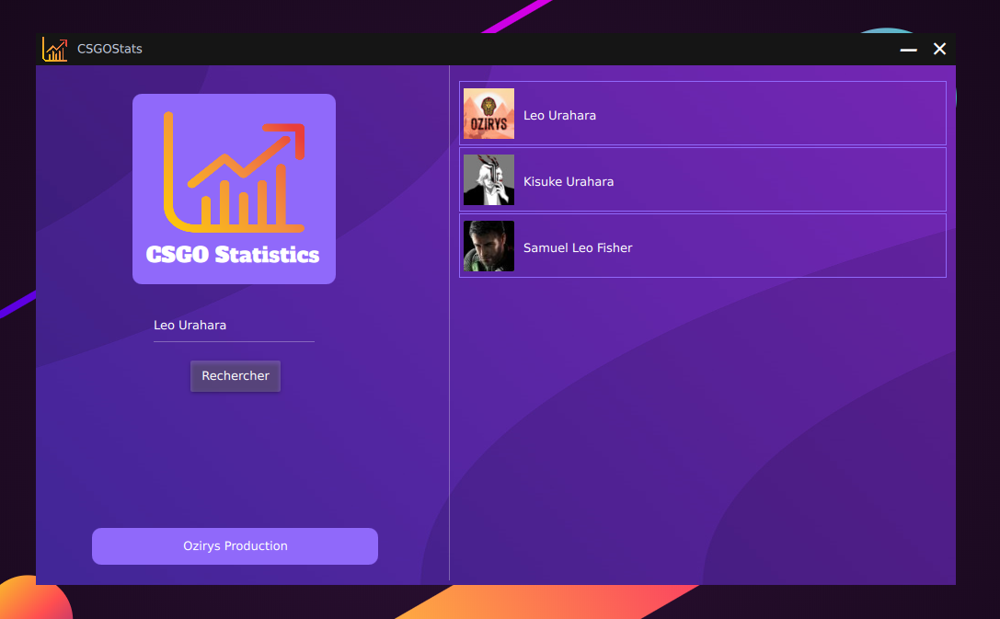

</a>

 

<h2 style="font-family: sans-serif; font-weight: normal;" align="center"><strong>CSGO statistics</strong> with a graphical interface</h2>

 

## Dépendance

- requests
- bs4
- PySide6

## Usage

Clone le repo, et ...

- `cd CSGOStatsGUI/`
- `pip install -r requirements.txt`
- `python main.py`

## Gameplay

